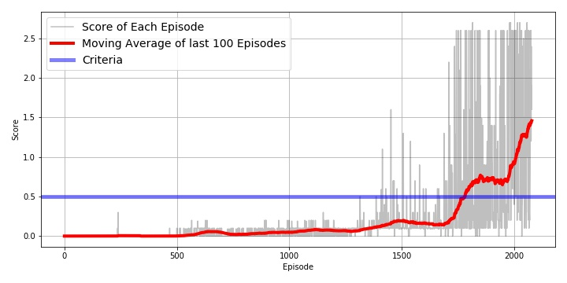

# Multi-Agent Deep Reinforcement Learning
Using Distributed Distributional Deterministic Policy Gradients (D4PG) for training two agents to play Tennis.

This project repository contains the work for the Udacity's [Deep Reinforcement Learning Nanodegree](https://www.udacity.com/course/deep-reinforcement-learning-nanodegree--nd893) Project 3: Collaboration and Competition.

## Project's goal

In this project, two agents control rackets to bounce a ball over a net. If an agent hits the ball over the net, it receives a reward of +0.1.  If an agent lets a ball hit the ground or hits the ball out of bounds, it receives a reward of -0.01.  **Thus, the goal of each agent is to keep the ball in play.**

The task is episodic, and in order to solve the environment, **the agents must get an average score of +0.5 (over 100 consecutive episodes, after taking the maximum over both agents)**. Specifically,

- After each episode, we add up the rewards that each agent received (without discounting), to get a score for each agent. This yields 2 (potentially different) scores. We then take the maximum of these 2 scores.
- This yields a single **score** for each episode.

The environment is considered solved, when the average (over 100 episodes) of those **scores is at least +0.5.**

### About Deep Reinforcement Learning

> [Reinforcement learning](https://skymind.ai/wiki/deep-reinforcement-learning) refers to goal-oriented algorithms, which learn how to attain a complex objective (goal) or maximize along a particular dimension over many steps; for example, maximize the points won in a game over many moves. They can start from a blank slate, and under the right conditions they achieve superhuman performance. Like a child incentivized by spankings and candy, these algorithms are penalized when they make the wrong decisions and rewarded when they make the right ones – this is reinforcement.

In this project a variant of D4PG algorithm called **Multi Agent Deep Distributed Distributional Deterministic Policy Gradients (MAD4PG)** which is  described in the paper [Distributed Distributional Deterministic Policy Gradients](https://arxiv.org/pdf/1804.08617.pdf)

### Environment details

The environment is based on [Unity ML-agents](https://github.com/Unity-Technologies/ml-agents). The project environment provided by Udacity is similar to the [Tennis](https://github.com/Unity-Technologies/ml-agents/blob/master/docs/Learning-Environment-Examples.md#tennis) environment on the Unity ML-Agents GitHub page.

> The Unity Machine Learning Agents Toolkit (ML-Agents) is an open-source Unity plugin that enables games and simulations to serve as environments for training intelligent agents. Agents can be trained using reinforcement learning, imitation learning, neuroevolution, or other machine learning methods through a simple-to-use Python API. 

The observation space consists of 8 variables corresponding to the position and velocity of the ball and racket. Each agent receives its own, local observation.  Two continuous actions are available, corresponding to movement toward (or away from) the net, and jumping. 

- Set-up: Two-player game where agents control rackets to bounce ball over a net.
- Goal: The agents must bounce ball between one another while not dropping or sending ball out of bounds.
- Agents: The environment contains two agent linked to a single Brain named TennisBrain. After training you can attach another Brain named MyBrain to one of the agent to play against your trained model.
- Agent Reward Function (independent):
  - +0.1 To agent when hitting ball over net.
  - -0.1 To agent who let ball hit their ground, or hit ball out of bounds.
- Brains: One Brain with the following observation/action space.
- Vector Observation space: 8 variables corresponding to position and velocity of ball and racket.
  - In the Udacity provided environment, 3 observations are stacked (8 *3 = 24 variables) 
- Vector Action space: (Continuous) Size of 2, corresponding to movement toward net or away from net, and jumping.
- Visual Observations: None.
- Reset Parameters: One, corresponding to size of ball.
- Benchmark Mean Reward: 2.5
- Optional Imitation Learning scene: TennisIL.

### Solving the Environment

In this Udacity project, the environment is considered solved, when the average (over 100 episodes) of those **scores is at least +0.5.**

## Getting started

### Installation requirements

- You first need to configure a Python 3.6 / PyTorch 0.4.0 environment with the needed requirements as described in the [Udacity repository](https://github.com/udacity/deep-reinforcement-learning#dependencies)
- Of course you have to clone this project and have it accessible in your Python environment
- Then you have to install the Unity environment as described in the [Getting Started section](https://github.com/udacity/deep-reinforcement-learning/blob/master/p3_collab-compet/README.md) (The Unity ML-agent environment is already configured by Udacity)

- Download the environment from one of the links below.  You need only select the environment that matches your operating system:
    - Linux: [click here](https://s3-us-west-1.amazonaws.com/udacity-drlnd/P3/Tennis/Tennis_Linux.zip)
    - Mac OSX: [click here](https://s3-us-west-1.amazonaws.com/udacity-drlnd/P3/Tennis/Tennis.app.zip)
    - Windows (32-bit): [click here](https://s3-us-west-1.amazonaws.com/udacity-drlnd/P3/Tennis/Tennis_Windows_x86.zip)
    - Windows (64-bit): [click here](https://s3-us-west-1.amazonaws.com/udacity-drlnd/P3/Tennis/Tennis_Windows_x86_64.zip)
    
    (_For Windows users_) Check out [this link](https://support.microsoft.com/en-us/help/827218/how-to-determine-whether-a-computer-is-running-a-32-bit-version-or-64) if you need help with determining if your computer is running a 32-bit version or 64-bit version of the Windows operating system.

    (_For AWS_) If you'd like to train the agent on AWS (and have not [enabled a virtual screen](https://github.com/Unity-Technologies/ml-agents/blob/master/docs/Training-on-Amazon-Web-Service.md)), then please use [this link](https://s3-us-west-1.amazonaws.com/udacity-drlnd/P3/Tennis/Tennis_Linux_NoVis.zip) to obtain the "headless" version of the environment.  You will **not** be able to watch the agent without enabling a virtual screen, but you will be able to train the agent.  (_To watch the agent, you should follow the instructions to [enable a virtual screen](https://github.com/Unity-Technologies/ml-agents/blob/master/docs/Training-on-Amazon-Web-Service.md), and then download the environment for the **Linux** operating system above._)

- Finally, unzip the environment archive in the 'project's environment' directory and eventually adjust the path to the UnityEnvironment in the code.

Note: A conda environment file is provided with this project (so you can check/install the versions of the libraries I used)

    
### Training the agents
    
This project has been developed and the D4PG algorithm has been trained on two platforms: the first platform is A laptop with the follwing configuration: Windows 10 Pro 64-bit, Intel Core i5-4200U CPU @ 1.6GHz, 8.0GB RAM. The second is the Udacity Online Workspace which allows using a GPU.

The details about the training specifics and the results can be found in this [report](Report.pdf), as well as the training performance achieved is shown below:

Note :
- Manually playing with the environment is poosible on the laptop platform, but not with the online udacity workspace (No Virtual Screen).    
- Watching the trained agent playing in the environment is possible as well on the laptop platform, but not the Udacity Online Worspace (No Virtual Screen).

